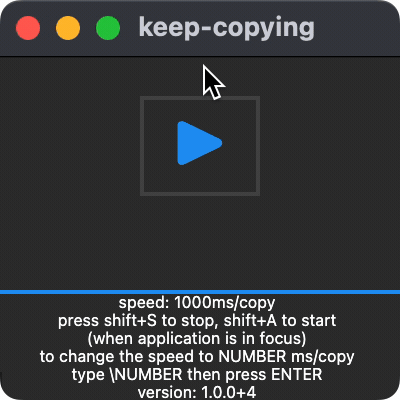

# keep-copying

- [X] Test on Mac OS X 13.1 [download link](https://github.com/monki1/keep-copying/raw/main/builds/keep_copying_mac.zip)
- [ ] Test on Windows

- press shift+S to stop, shift+A to start
  - (when application is in focus)
- to change the SPEED to NUMBER ms/copy
  - type \NUMBER then press ENTER
  - default is 1000 ms/copy
- to STOP after N minutes
  - type /N then press ENTER
- version: 1.0.0+4
- 